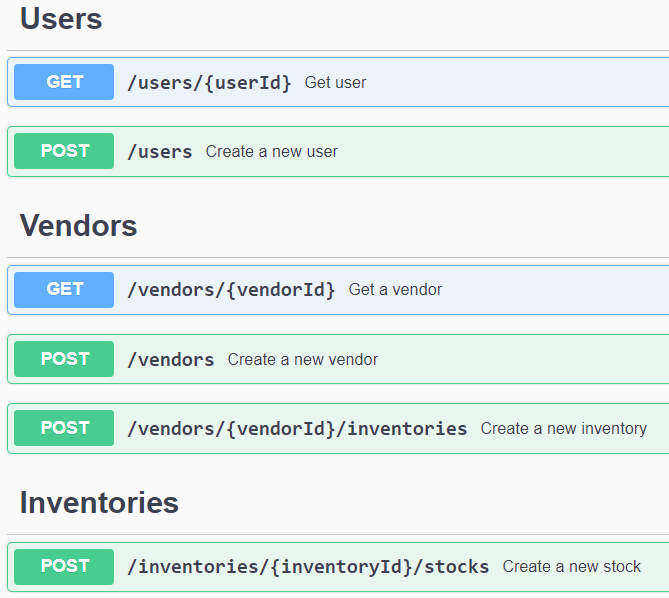

# Hemat Rasa

Hemat Rasa is an application aimed at reducing food waste created by the Bit Bandits team for GDSC HackFest 2023/2024. It allows food buyers (such as restaurants and consumers) to

1. purchase food based on its expiration date;
2. and enables food sellers (such as supermarkets) to advertise and sell food nearing its expiration date at a discounted price.

The hope is that food consumers will be incentivized to buy food close to its expiration date with a cheaper price, and food sellers will prefer to sell nearing-expiry items rather than throwing them away.

Additionally, Hemat Rasa has a social media feature facilitating the sharing of leftover food among community members. When users want to stock their kitchens after shopping, they scan each food item's barcode, input its quantity and expiration date. Over time, Hemat Rasa reminds users of approaching expiration dates. If a user has food close to expiration but doesn't intend to consume it, they can create a post on Hemat Rasa with details like

1. the food's name,
2. expiration date,
3. quantity,
4. and location.

Interested users can press the "Interested" button and visit the location to collect the food.

